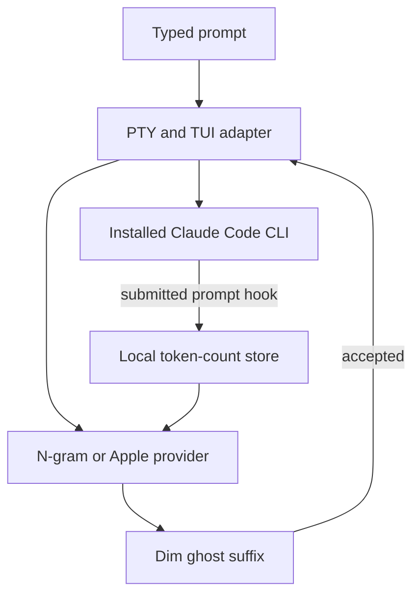

# Claude Code Word Completion Companion

**Status:** Draft technical specification  
**Research checked:** 2026-09-29  
**Working product shape:** macOS companion launcher for Claude Code CLI  
**Scope:** Local N-gram completion and Apple dictionary completion. SmolLM is excluded.

## 1. Summary

Build a macOS companion that shows one dim inline word completion while a user writes a natural-language prompt for Claude Code. The prompt remains unchanged until the user accepts the suggestion. The two completion providers are:

1. **N-gram:** learns word sequences from prompts the user has submitted and predicts a matching word from the current partial word and preceding words.
2. **Apple:** asks macOS `NSSpellChecker` for completions for the current partial word.

The screenshots supplied for this request are the visual and behavior reference. Match their single-line ghost-text treatment and the two provider choices. The user can select **Off**, **N-gram**, or **Apple**. There is no SmolLM provider, network model, or LLM request for completion.

## 2. Research findings

As of the research date, there is no documented Claude Code plugin API that lets a plugin read keystrokes from the active prompt composer or render a word-level ghost completion there. Claude Code plugins package skills, agents, hooks, and MCP servers. `UserPromptSubmit` runs after the user submits text, so it can help the N-gram engine learn but cannot supply a completion while the user is typing. [Plugin overview](https://code.claude.com/docs/en/plugins) · [Hooks reference](https://code.claude.com/docs/en/hooks#userpromptsubmit)

| Existing feature or project | What it does | How it relates |
| --- | --- | --- |
| Oh My Pi | The reference screenshots show N-gram learned from prompt history and Apple macOS dictionary completions, rendered as inline hints. | This is the target interaction and engine set. |
| Claude Code prompt suggestions | Shows an example or next-prompt ghost suggestion when a session opens or after Claude responds. It is a whole-prompt suggestion, not completion of the word currently being typed. | Similar rendering, different trigger and prediction. [Interactive mode docs](https://code.claude.com/docs/en/interactive-mode#prompt-suggestions) |
| Claude Code spellcheck | Uses Aspell, Hunspell, or Ispell to underline words it does not recognize. It does not complete or replace the active word. | Useful adjacent functionality, not the requested feature. [Interactive mode docs](https://code.claude.com/docs/en/interactive-mode) |
| Claude Code autocomplete | Provides command, emoji, file path, and shell-history completion in their relevant input modes. | These completion menus must keep working and take priority when open. [Interactive mode docs](https://code.claude.com/docs/en/interactive-mode) |
| T9T | Its author describes it as a local macOS terminal helper that corrects obvious prompt typos using `NSSpellChecker` in Claude, Codex, and Gemini. | Adjacent prior art for terminal input and Apple APIs; the public description is typo correction, not N-gram/Apple word completion. Inspect its current repository before considering code reuse. [Project](https://github.com/Xsamsx/T9T) · [Author's post](https://www.reddit.com/r/MacOS/comments/1rqgock/t9_in_the_terminal/) |

Apple exposes `NSSpellChecker`’s `completions(forPartialWordRange:in:language:inSpellDocumentWithTag:)` API for returning full words based on a partial word. [Apple API reference](https://developer.apple.com/documentation/AppKit/NSSpellChecker/completions%28forPartialWordRange%3Ain%3Alanguage%3AinSpellDocumentWithTag%3A%29?language=objc)

## 3. Product decision

This should be specified as a **companion launcher**, not as a Claude Code plugin. A plugin can install the optional prompt-learning hook, but it cannot own the live composer through the documented extension API.

The first implementation should run the installed `claude` executable as a child process under a pseudo-terminal and proxy its input and output. The companion intercepts input only while the Claude prompt composer is active; otherwise it passes input through unchanged. This preserves the installed CLI’s authentication, agent loop, permissions, MCP servers, plugins, and session behavior without patching Claude’s binary or making model/API calls for autocomplete.

This architecture has one major feasibility risk: Claude Code’s TUI does not expose a stable external composer API. A short PTY prototype must prove it can track the composer and draw ghost text without breaking input or terminal rendering. If it cannot do that reliably, pause the transparent wrapper approach and pursue an upstream prompt-input provider API. A standalone Agent SDK interface is a separate product direction, because it owns a different prompt UI and may have different authentication and branding requirements. [Agent SDK overview](https://code.claude.com/docs/en/agent-sdk/overview)

## 4. Goals and non-goals

### Goals

- Show one inline, dim suffix that completes the current word as the user types in Claude Code’s prompt.
- Offer the N-gram and Apple providers independently, plus Off.
- Keep prediction local and fast; do not call a remote model.
- Preserve the user’s existing Claude Code workflow and account setup.
- Never insert a completion unless the user explicitly accepts it.
- Avoid stealing keystrokes from Claude’s own command, path, emoji, and shell completions.

### Non-goals for v1

- SmolLM, cloud inference, or LLM-generated completions.
- Code completion, command completion, path completion, prompt rewriting, or automatic typo correction.
- Replacing Claude Code’s response renderer or agent runtime.
- Linux and Windows support.
- A Claude Code binary patch or dependency on private JavaScript internals.

## 5. User experience

1. The user launches Claude Code through the companion, for example `ccword` (working name), followed by normal Claude CLI arguments.
2. When a natural-language word prefix is eligible, the companion shows the remainder of one predicted word in dim text after the typed prefix. Example: typed `he` with the ghost suffix `lp` visually reads `help`.
3. Pressing **Right Arrow** accepts the word and appends a space. Pressing **Tab** accepts the word without appending a space, matching the reference behavior.
4. Typing another character refreshes the prediction. Escape, Backspace, cursor movement away from the end, or a mode change dismisses the hint without changing the prompt.
5. **Enter always submits only text the user has typed or accepted.** A visible hint is never submitted implicitly.
6. The user selects **Off**, **N-gram**, or **Apple** in companion settings. Mode changes are local and take effect immediately.

### Suggestion eligibility

Show hints only for an alphabetic partial word of at least two characters when the insertion point is at the end of a natural-language prompt. Suppress hints while a native Claude completion menu is open and in these contexts:

- Slash commands, `@` mentions, file paths, URLs, command-line flags, shell mode (`!`), backticks, obvious code tokens, numeric identifiers, selected text, multiline edits away from the last line, or IME composition.
- Any state the PTY adapter cannot identify with confidence.

Start with one candidate and no popup. Keep the ghost suffix visually distinct but low contrast. Do not color or underline the user’s typed text.

## 6. Functional requirements

### FR-1: Transparent launch and passthrough

- Resolve the real Claude executable without recursively resolving the companion.
- Forward CLI arguments, environment variables, current directory, stdin/stdout/stderr semantics, exit status, terminal dimensions, signals, and control sequences.
- Preserve resize (`SIGWINCH`), interrupt (`Ctrl+C`), suspend/resume (`Ctrl+Z`), bracketed paste, alternate-screen, and terminal mode behavior.
- If stdin/stdout is not a TTY, autocomplete is disabled and the invocation is passed through unchanged.
- If the Claude version or TUI state is unsupported, fail open: disable suggestions and continue normal passthrough.
- Do not modify Claude Code’s settings or replace its executable.

### FR-2: Completion engine selection

Configuration has exactly three values in v1: `off`, `ngram`, and `apple`. N-gram and Apple remain separate modes; do not blend their scores. Store configuration in the companion’s own user config, not in Claude’s managed settings.

### FR-3: N-gram prediction

- Learn only from user prompts, not assistant replies, tool output, or repository files.
- Tokenize submitted prompts into words, normalize for lookup, and retain enough case information to render a natural completion.
- Use preceding word context and a partial-word prefix to rank known next-word candidates. Back off from longer contexts to shorter contexts when data is sparse; apply recency decay so recent usage gradually matters more.
- Require a configurable minimum confidence/support threshold. Return no hint when evidence is weak.
- Do not save full prompt text. Persist token-sequence counts and timestamps needed for ranking and decay.
- Provide a cold-start state with no hint until the user has enough local history.

### FR-4: Prompt learning integration

- Provide an optional Claude Code `UserPromptSubmit` hook packaged with the companion. It can asynchronously send the submitted prompt to the local tokenizer/store after Enter; it must never block or change the prompt sent to Claude.
- The companion should also learn from prompts entered through its own wrapper, so the hook is not required for basic use.
- Any initial import of Claude Code prompt history must be explicit, local-only, previewable, and reversible. Do not silently scan transcript files. Treat transcript formats as undocumented unless Anthropic documents them.
- Include commands to pause learning, clear learned data, and view the configured storage location.

### FR-5: Apple completion

- Use macOS AppKit `NSSpellChecker`’s partial-word completion API; honor the selected macOS spelling language, with a configurable language override if necessary.
- Ask for completions using only the current prompt string and partial-word range. Return one candidate after prefix validation.
- Keep Apple completions on-device. If the API returns no usable candidate, show no hint.
- Do not perform automatic correction or mutate the user’s text.

### FR-6: Keyboard and input safety

- Intercept Right Arrow and Tab only when the companion’s own ghost suffix is visible, the prompt editor has focus, and Claude is not showing a native suggestion/completion menu.
- In all other states, forward those keys unchanged.
- A hint must be display-only until accepted. On acceptance, insert only the missing suffix at the current cursor position; optionally append one ASCII space for Right Arrow.
- Test Unicode graphemes and UTF-16 range conversion because the Apple API uses `NSRange`.

### FR-7: Configuration and diagnostics

- Provide a short configuration command or menu for mode, language, learning, minimum confidence, and key behavior.
- Provide a diagnostic command that reports Claude path/version, TTY/terminal support, selected provider, Apple language availability, and hook status without printing prompts or learned tokens.
- A debug mode may record parser state and timing, but must redact prompt text by default.

## 7. Architecture

### Components

1. **Launcher / PTY supervisor:** Starts the real Claude CLI in a pseudo-terminal, proxies byte streams, forwards signals and resize events, and enables interception only in supported composer states.
2. **TUI adapter:** Maintains a terminal screen model from Claude’s ANSI output, identifies the prompt composer and native completion states, and tracks edits to the active input buffer. Use versioned adapters and disable predictions on unknown layouts.
3. **Completion service:** Receives the active word prefix, preceding context, language, mode, and cursor state. Returns either one candidate or none. Runs local and asynchronously with a short deadline.
4. **Providers:** `NgramProvider` reads local token counts; `AppleProvider` calls `NSSpellChecker`.
5. **Local store:** SQLite database in the user’s Application Support directory, restricted to the current user. Stores token n-grams and timestamps, not complete prompts.
6. **Optional Claude plugin hook:** A fast, asynchronous `UserPromptSubmit` hook feeds newly submitted prompt text into the local learner. This is a learning integration only; it does not implement live completion.

### Data flow

### Implementation baseline

- **Language/runtime:** Swift command-line executable, targeting macOS. Swift provides direct AppKit access for `NSSpellChecker` and Foundation text tokenization.
- **Terminal process:** POSIX pseudo-terminal APIs (`openpty`/`forkpty` or an audited wrapper) with an ANSI screen-state parser. Keep all TUI interception behind a narrow adapter so it can be replaced if Claude changes its renderer.
- **Storage:** SQLite with user-only filesystem permissions. No cloud sync or telemetry in v1.
- **Prediction:** Local prefix index over N-gram counts plus context backoff and recency weighting. No model download.
- **Distribution:** Signed/notarized macOS binary or Homebrew formula after the PTY compatibility spike succeeds.

## 8. Privacy and security

- Prediction and learning stay on the Mac. No prompt text, words, or token counts leave the machine.
- Collect only submitted user prompt text at the hook boundary; do not inspect Claude’s replies, tool output, or files.
- Make learning opt-in and visible. Add a clear-data command and document that token n-grams can still contain sensitive phrases even when full prompts are not stored.
- Use file permissions that prevent other local users from reading the database. Do not write prompt content to logs, crash reports, or telemetry.
- The wrapper must not change permission mode, approved tools, MCP configuration, plugins, or authentication. It forwards execution to the user’s installed Claude Code CLI.
- Hook failures must be non-blocking and must not affect prompt submission.

## 9. Acceptance criteria

- With Apple mode selected, typing `he` can display a matching Apple completion such as `lp` when macOS returns `help` for the selected language.
- With N-gram mode selected and sufficient history, the same prefix/context can display a learned completion. With no adequate history, it displays nothing.
- Neither provider makes network requests or downloads a model.
- Enter while a ghost suffix is visible submits the typed text only. Right Arrow and Tab accept only when the companion hint is active and do not corrupt Claude’s own completion workflows.
- When suggestions are disabled, unavailable, slow, or unsupported, all user input reaches Claude unchanged.
- The wrapper preserves session selection/resume, native permission prompts, command mode, `@` file references, `/` commands, multiline input, pasted content, terminal resize, Ctrl-C, and exit status in the supported Claude/terminal matrix.
- Prediction latency target: under 30 ms at p95 from the last keystroke to rendered hint on a supported Mac.
- Learning can be paused and all learned data can be deleted locally.

## 10. Verification plan

### Feasibility spike — required before the full build

Build a no-prediction PTY prototype that launches the installed CLI. Confirm it can:

1. Identify the active composer and distinguish it from permission dialogs, slash menus, shell mode, and transcript output.
2. Track ordinary typing, Backspace, word movement, Home/End, multiline edits, paste, and UTF-8/IME input without desynchronizing.
3. Render and remove one synthetic ghost suffix while preserving cursor position and Claude’s own redraws.
4. Pass all other keyboard input, terminal output, signals, and resize events through correctly.

Test at minimum in Apple Terminal, iTerm2, Ghostty, and WezTerm. If the adapter cannot remain fail-open and reliable, do not ship a transparent wrapper; request an official composer/provider API or build a separately branded SDK-based terminal client after authentication and policy review.

### Automated and manual checks

- Unit tests: tokenizer, context backoff, prefix filtering, recency decay, confidence cutoff, language/case handling, and store deletion.
- macOS integration tests: `NSSpellChecker` with installed languages and user dictionaries; no-result and unsupported-language cases.
- PTY tests: fake Claude TUI fixtures for redraws, input editing, paste, resize, signals, native suggestion menus, and unknown versions.
- Manual regression: run real Claude sessions with native prompt suggestions enabled and disabled; exercise normal prompts, `/` commands, `@` paths, `!` shell mode, multiline input, and permission prompts.
- Privacy check: confirm no full prompts or prompt fragments are emitted to logs and no network traffic is generated by providers.

## 11. Delivery phases

1. **Feasibility spike:** PTY passthrough, composer detection, ghost rendering, key forwarding. Go/no-go decision before product implementation.
2. **Local completion prototype:** A small prompt editor harness tests Apple API behavior and N-gram scoring independent of Claude’s TUI.
3. **Alpha companion:** Off/N-gram/Apple settings, wrapper integration, privacy controls, and diagnostics.
4. **Learning integration:** Optional `UserPromptSubmit` hook, import preview if a stable/documented route exists, and clear-data support.
5. **Compatibility release:** Version/terminal test matrix, signed/notarized distribution, and documented unsupported states.

## 12. Open decisions

- Final product name and command name.
- Whether the N-gram store is global only or optionally isolated per project.
- Whether users want explicit history import in addition to learning new submissions.
- Minimum supported macOS and Claude Code versions, set after the feasibility spike.
- Whether to pursue an upstream Claude Code plugin API proposal if PTY rendering proves too fragile.

## 13. Sources

- [Claude Code plugins](https://code.claude.com/docs/en/plugins)
- [Claude Code hooks](https://code.claude.com/docs/en/hooks)
- [Claude Code interactive mode](https://code.claude.com/docs/en/interactive-mode)
- [Claude Code Agent SDK overview](https://code.claude.com/docs/en/agent-sdk/overview)
- [Apple `NSSpellChecker` word completions](https://developer.apple.com/documentation/AppKit/NSSpellChecker/completions%28forPartialWordRange%3Ain%3Alanguage%3AinSpellDocumentWithTag%3A%29?language=objc)
- [Oh My Pi settings](https://github.com/can1357/oh-my-pi/blob/main/docs/settings.md)
- [T9T repository](https://github.com/Xsamsx/T9T) and [author’s public description](https://www.reddit.com/r/MacOS/comments/1rqgock/t9_in_the_terminal/)
- User-provided Oh My Pi screenshots, dated 2026-09-29.
